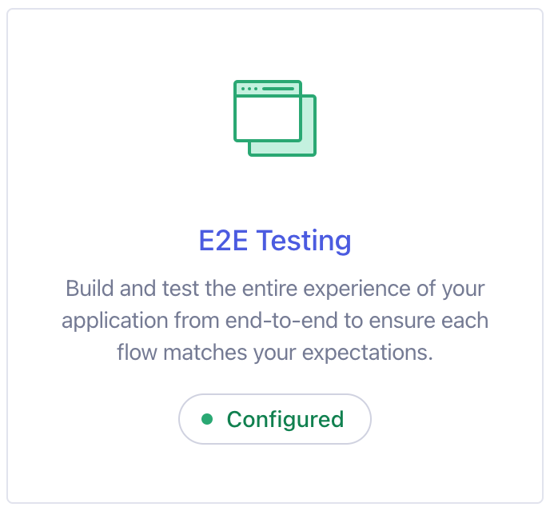
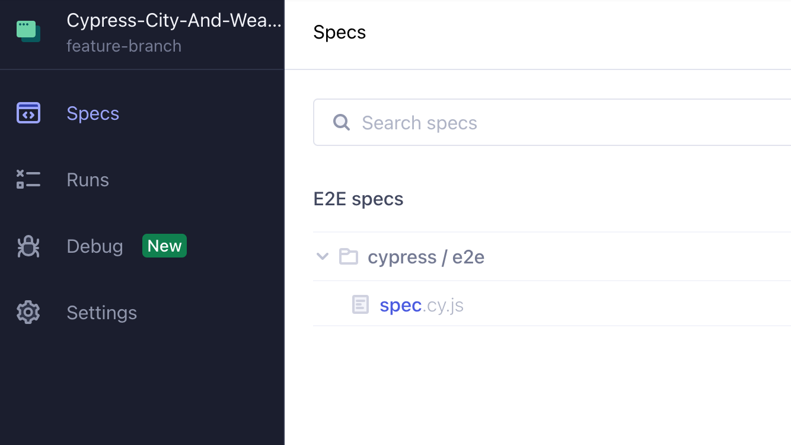

# Cypress-City-And-Weather-Test

## Introduction
This test navigates to a Wikipedia page with a list of cities in the UK, it will select 10 random cities from the table and then it selects one random city from the previously selected cities.
Now, it navigates to BBC weather website and it uses the city as input and it will search the weather for the next Saturday.
It will then do the same for all the rest of the cities in the list.
The test passes if all the cities have been checked and it will return the first sunny city with at least 10c.

## Prerequisites 
You need to install the following:

- npm
- node
- cypress

## Usage

clone this repository 
``` bash
git clone https://github.com/AgataLP/Cypress-City-And-Weather-Test.git 
``` 
go into this repository and start cypress 

``` bash
cd Cypress-City-And-Weather-Test
npx cypress open 
``` 
 A cypress window should open now, click the E2E Testing 

 

 Then click the browser you will use and then start the E2E testing

 

Finally locate the spec and run the test 




